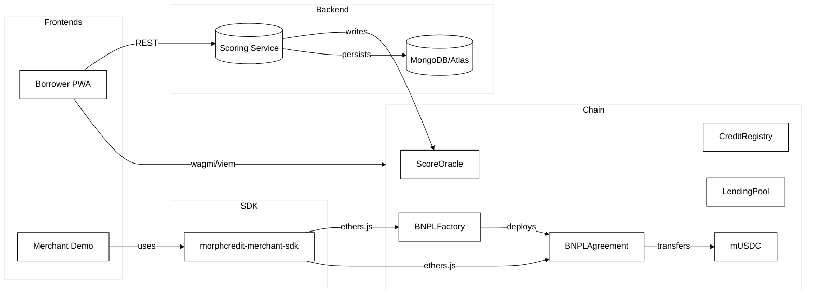
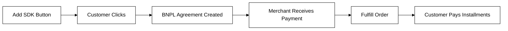
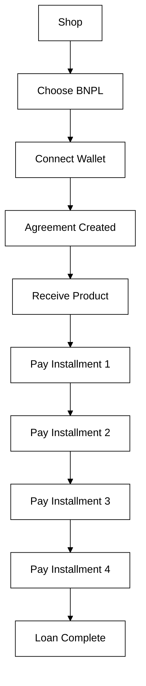
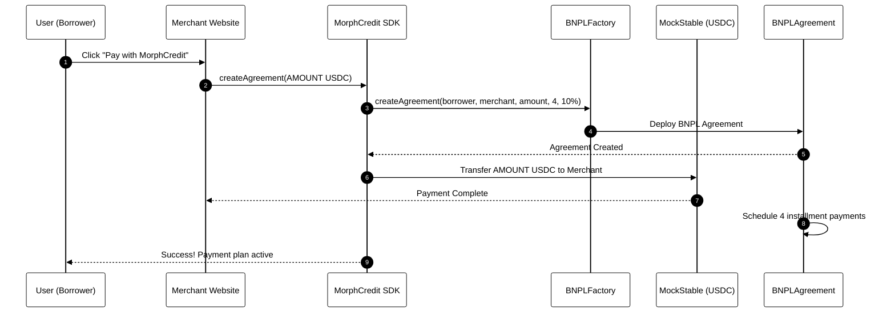
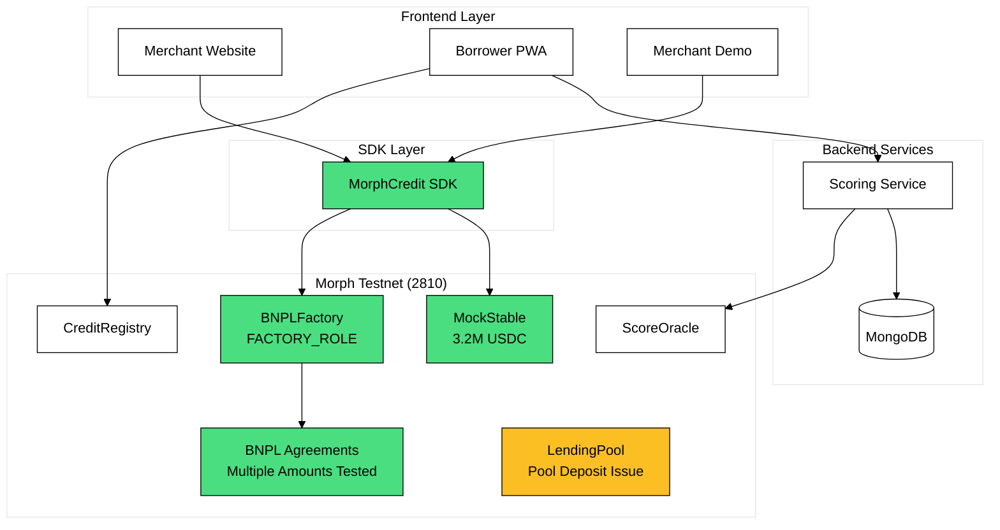
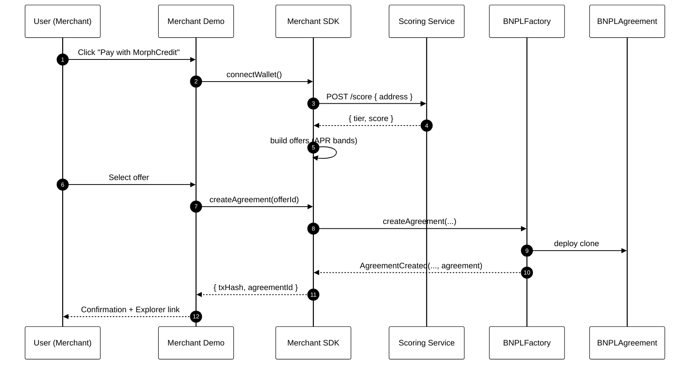

## MorphCredit

End-to-end, no-mocks deployment of MorphCredit on Morph Holesky Testnet (Chain ID 2810). Includes smart contracts, scoring service, Borrower PWA, Merchant Demo, and a publishable Merchant SDK.

### Architecture



### Monorepo layout

- apps/borrower-pwa: Borrower portal (Vite + React + wagmi + AppKit)
- apps/merchant-demo: Merchant storefront demo using the SDK
- packages/merchant-sdk: Publishable SDK for merchants
- contracts: Hardhat (deploys ScoreOracle, CreditRegistry(Simple), LendingPool, BNPL/LoC)
- scoring: Express scoring service (MongoDB, WebAuthn, on-chain publish)

### SYSTEM STATUS (FULLY OPERATIONAL)

**BNPL System Ready for Production**
- All contracts deployed and configured on Morph Testnet
- Merchant addresses configured with proper roles
- BNPL agreements successfully tested with various loan amounts
- SDK button integration working
- Direct payment mechanism operational

### Testnet config (Morph Holesky)

- RPC: https://rpc-holesky.morphl2.io
- Explorer: https://explorer-holesky.morphl2.io
- Chain ID: 2810
- Addresses: apps/config/addresses.json

### Contract Configuration
```json
{
  "scoreOracle": "0x[DEPLOYED_ADDRESS]",
  "oracleSigner": "0x[MERCHANT_ADDRESS]",
  "creditRegistry": "0x[DEPLOYED_ADDRESS]",
  "lendingPool": "0x[DEPLOYED_ADDRESS]",
  "mockStable": "0x[DEPLOYED_ADDRESS]",
  "bnplFactory": "0x[DEPLOYED_ADDRESS]",
  "bnplAgreementImpl": "0x[DEPLOYED_ADDRESS]"
}
```
*Note: Create a a file in `apps/config/addresses.json` for actual deployed addresses*

### Quick start (local dev)

1) Install and build

```bash
pnpm install
pnpm -w build
```

2) Start services

```bash
# Scoring service
cd scoring && PORT=8787 MORPH_RPC=https://rpc-holesky.morphl2.io pnpm dev

# Borrower PWA
cd apps/borrower-pwa && VITE_SCORING_URL=http://localhost:8787 pnpm dev

# Merchant Demo
cd apps/merchant-demo && pnpm dev
```

### Production deployment

- UI on Vercel (Merchant Demo)
  - Project root: `apps/merchant-demo`
  - Build command: `pnpm i --frozen-lockfile && pnpm -r build && pnpm build`
  - Output directory: `dist`
  - Env (optional): none required; uses on-chain RPC and repo config

- Borrower PWA on Vercel
  - Project root: `apps/borrower-pwa`
  - Build command: `pnpm i --frozen-lockfile && pnpm -r build && pnpm build`
  - Output directory: `dist`
  - Env: set `VITE_*` vars (see below)

- Scoring service on Render
  - One-click via `render.yaml` at repo root
  - Set environment variables (see below)

- SDK on npm
  - Package: `morphcredit-merchant-sdk`
  - `pnpm -w -F morphcredit-merchant-sdk build`
  - `cd packages/merchant-sdk && npm publish --access public`

### Environment variables

Scoring (`scoring/.env` or Render):
- MORPH_RPC: Morph Holesky RPC URL
- SCORE_ORACLE_ADDRESS: Deployed ScoreOracle
- ORACLE_PRIV_KEY: Oracle signer private key (funded)
- MONGODB_URI: Connection string to MongoDB/Atlas
- MONGODB_DB: Database name
- RP_ID, RP_ORIGIN: WebAuthn relying party settings
- PORT: Web port (Render provides)

Borrower PWA (`apps/borrower-pwa/.env` or Vercel):
- VITE_MORPH_CHAIN_ID=2810
- VITE_MORPH_RPC_URL=https://rpc-holesky.morphl2.io
- VITE_EXPLORER_URL=https://explorer-holesky.morphl2.io
- VITE_SCORING_URL=https://your-render-service.onrender.com
- VITE_WALLETCONNECT_PROJECT_ID=...

### Merchant SDK usage

```ts
import { MorphCreditSDK } from 'morphcredit-merchant-sdk';

const sdk = new MorphCreditSDK();
await sdk.connectWallet();
const offers = await sdk.getOffers({ address: await sdk.getWalletAddress()!, amount: 499.99 });
const { txHash, agreementId } = await sdk.createAgreement(offers[0].id);
console.log({ txHash, agreementId });
```

## USER WORKFLOWS

### **Merchant Workflow**

#### **Integration Steps:**
1. **Install SDK**
   ```bash
   npm install morphcredit-merchant-sdk
   ```

2. **Add BNPL Button**
   ```tsx
   import { MorphCreditButton } from 'morphcredit-merchant-sdk';
   
   <MorphCreditButton
     amount={499.99}
     userAddress={customerWallet}
     onSuccess={(result) => {
       console.log('BNPL Created:', result.agreementId);
       // Process order completion
     }}
     onError={(error) => console.error(error)}
   />
   ```

3. **Handle Success**
   - Agreement created automatically
   - Merchant receives payment immediately
   - Customer gets payment schedule

#### **Operational Flow:**


---

### **Developer Workflow**

#### **Local Development:**
1. **Clone & Setup**
   ```bash
   git clone https://github.com/your-repo/morphcredit
   cd morphcredit
   pnpm install
   pnpm -w build
   ```

2. **Run Services**
   ```bash
   # Terminal 1: Scoring Service
   cd scoring && PORT=8787 pnpm dev
   
   # Terminal 2: Borrower PWA
   cd apps/borrower-pwa && pnpm dev
   
   # Terminal 3: Merchant Demo
   cd apps/merchant-demo && pnpm dev
   ```

3. **Test Integration**
   ```bash
   # Verify system
   cd contracts
   npx hardhat run scripts/final-bnpl-verification.js --network morph-testnet
   ```

#### **Contract Interaction:**
```typescript
// For advanced developers
import { ethers } from 'ethers';

const provider = new ethers.JsonRpcProvider('https://rpc-holesky.morphl2.io');
const bnplFactory = new ethers.Contract(
  addresses.bnplFactory,  // From config
  ['function createAgreement(address,address,uint256,uint256,uint256) returns (address)'],
  signer
);

const agreementAddress = await bnplFactory.createAgreement(
  borrowerAddress,    // Customer wallet address
  merchantAddress,    // Merchant wallet address  
  ethers.parseUnits(amount.toString(), 6),  // Loan amount in USDC
  4,           // 4 installments
  1000         // 10% APR
);
```

#### **Development Tools:**
- **Verification**: `scripts/final-bnpl-verification.js`
- **Role Management**: `scripts/grant-role.js`
- **Pool Status**: `scripts/check-pool-liquidity.js`
- **Factory State**: `scripts/check-factory-state.js`

---

### **Borrower Workflow**

#### **Getting Started:**
1. **Visit Merchant Website**
   - Browse products
   - Add items to cart (minimum amount for BNPL)

2. **Select BNPL Payment**
   - Click "Pay with MorphCredit" button
   - Connect your wallet (MetaMask recommended)

3. **Agreement Creation**
   - System creates BNPL agreement automatically
   - Merchant receives payment immediately
   - You get payment schedule

4. **Payment Schedule**
   - **4 bi-weekly payments** of equal amounts
   - **Total cost**: Purchase amount + interest
   - **APR**: 10%
   - **Due dates**: Every 2 weeks

#### **Payment Flow:**


#### **Using Borrower PWA:**
1. **Access**: Visit [Borrower Portal URL]
2. **Connect Wallet**: Link your Morph testnet wallet
3. **View Agreements**: See all your active BNPL agreements
4. **Make Payments**: Pay installments directly
5. **Track Progress**: Monitor payment history

#### **Supported Wallets:**
- MetaMask (Recommended)
- WalletConnect compatible wallets
- Any Ethereum wallet supporting Morph network

#### **Network Setup:**
- **Network**: Morph Holesky Testnet
- **Chain ID**: 2810
- **RPC URL**: https://rpc-holesky.morphl2.io
- **Explorer**: https://explorer-holesky.morphl2.io

---

### **Quick Start Guide**

#### **For Merchants (5 minutes):**
```bash
# 1. Install
npm i morphcredit-merchant-sdk

# 2. Add button to your site
import { MorphCreditButton } from 'morphcredit-merchant-sdk';
<MorphCreditButton amount={499.99} onSuccess={handleSuccess} />

# 3. Test with Morph testnet
# Done!
```

#### **For Borrowers (2 minutes):**
1. Visit merchant website with MorphCredit
2. Add items to cart (minimum amount)
3. Click "Pay with MorphCredit"
4. Connect wallet → Get instant approval
5. Receive product → Pay in 4 installments

#### **For Developers (15 minutes):**
```bash
git clone [repo] && cd morphcredit
pnpm install && pnpm -w build
cd scoring && pnpm dev  # Terminal 1
cd apps/borrower-pwa && pnpm dev  # Terminal 2
cd apps/merchant-demo && pnpm dev  # Terminal 3
# Full system running!
```

---

### Licenses

MIT License. See `LICENSE`.

### OPERATIONAL FLOW DIAGRAMS

#### Current BNPL Flow (Working)


#### System Architecture (Current)


#### Legacy Sequence Diagram


### End‑to‑end demo flow (fresh wallet)

- Pre‑reqs
  - Switch wallet to Morph Holesky (chainId 2810).
  - Have a little test ETH for gas (Holesky → Morph bridge).
  - URLs: 

    *-* Borrower PWA: [morphcredit-borrower.vercel.app](https://morphcredit-borrower.vercel.app/)
   
    *-* Merchant Demo: [morphcredit-merchant-demo.vercel.app](https://morphcredit-merchant-demo.vercel.app/)

### 1) Borrower: set up and get a score
1. Open the Borrower app: [morphcredit-borrower.vercel.app](https://morphcredit-borrower.vercel.app/) and connect wallet.
2. Profile: set username (optional), upload avatar.
3. Credit Score page:
   - Click “Request Score”. The app:
     - Computes your score off‑chain.
     - Immediately publishes the signed score to the on‑chain ScoreOracle (no extra button).
     - Shows a success toast with a tx link.
4. Home updates with your live score and tier.

### 2) Merchant: create a BNPL agreement
1. Open the Merchant Demo: [morphcredit-merchant-demo.vercel.app](https://morphcredit-merchant-demo.vercel.app/) and connect wallet.
2. Add any item(s) to cart → click “Pay with MorphCredit”.
3. Offers appear (APR/schedule based on your tier). Pick a plan.
4. Sign the on‑chain tx. You’ll see an order confirmation with a Morph explorer link.
   - This deploys a BNPLAgreement to your address and funds the merchant.

### 3) Borrower: view agreement and repay
1. Back in the Borrower app:
   - Agreements tab: your new agreement is listed.
   - Repayments tab: shows “Pay next” when an installment is due.
2. Click “Pay next”:
   - First time only, you’ll approve mUSDC to the agreement (one tx).
   - Then you’ll sign the repay tx.
   - You’ll get a success toast with an explorer link; counts update (Paid/Remaining).
   - If you see “insufficient balance,” acquire test mUSDC, then retry (I can wire a tiny faucet if you want).

### 4) Optional PWA install (mobile/desktop)
- Click “Install App” (top‑right). On iOS Safari, use Share → “Add to Home Screen”.

Notes
- “Publish to Oracle” is automatic inside “Request Score”; if you prefer a separate button, say “split score buttons” and I’ll add it.
- Deep link/refresh issues: hard‑refresh once after deploy (service worker updated).
- Use the health endpoint to confirm the API is live before demos: https://morphcredit.onrender.com/health

Links referenced: [Borrower PWA](https://morphcredit-borrower.vercel.app/), [Merchant Demo](https://morphcredit-merchant-demo.vercel.app/).
