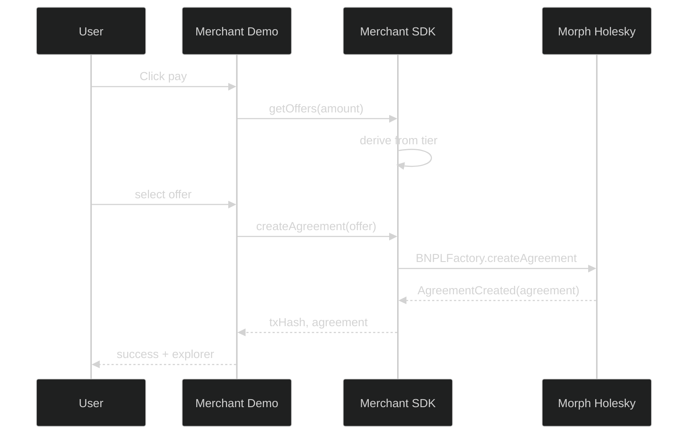

## Merchant Demo (Vercel-ready)

Showcases MorphCredit checkout with the Merchant SDK on Morph Holesky.

### Deploy on Vercel

- Project root: `apps/merchant-demo`
- Build command: `pnpm i --frozen-lockfile && pnpm -w build && pnpm build`
- Output: `dist`

### Local dev

```bash
pnpm install
pnpm dev
```

### What it does
- Browse products, add to cart
- Checkout with MorphCredit (wallet connect → offers → on-chain tx)
- Order confirmation with explorer link

### Diagram




