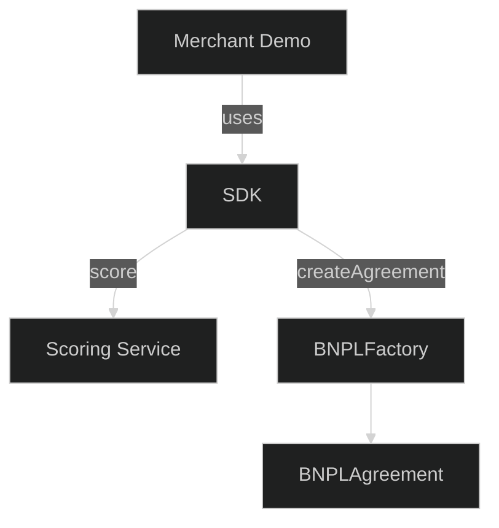

## morphcredit-merchant-sdk

Production-ready Merchant SDK for integrating MorphCredit BNPL on Morph Holesky (Chain ID 2810).

### Install

```bash
npm i morphcredit-merchant-sdk
# or
pnpm add morphcredit-merchant-sdk
```

### Quick start

```ts
import { MorphCreditSDK } from 'morphcredit-merchant-sdk';

const sdk = new MorphCreditSDK({}, { enableLogging: true });
await sdk.connectWallet();
const address = sdk.getWalletAddress()!;
const offers = await sdk.getOffers({ address, amount: 799.99 });
const result = await sdk.createAgreement(offers[0].id);
console.log('tx', result.txHash, 'agreement', result.agreementId);
```

### React button

```tsx
import { MorphCreditButton } from 'morphcredit-merchant-sdk';

<MorphCreditButton
  amount={499.99}
  showOffers
  onSuccess={(r) => console.log(r)}
  onError={(e) => console.error(e)}
/>;
```

### Config

```ts
new MorphCreditSDK({
  rpcUrl: 'https://rpc-holesky.morphl2.io',
  contracts: {
    scoreOracle: '0x...',
    creditRegistry: '0x...',
    lendingPool: '0x...',
    bnplFactory: '0x...'
  },
  scoringService: 'https://your-scoring.onrender.com',
  networkId: 2810,
});
```

### Events

```ts
sdk.onOffersLoaded((offers) => {...})
sdk.onAgreementCreated((tx) => {...})
sdk.onWalletConnected((addr) => {...})
```

### Error codes
- WALLET_CONNECTION_FAILED, WRONG_NETWORK, SCORE_NOT_FOUND, AGREEMENT_FAILED, INVALID_OFFER, NETWORK_ERROR, ...

### Security
- Factory role check before createAgreement
- Returns real agreement address from AgreementCreated event

### License
MIT

### Diagram



# MorphCredit Merchant SDK

A TypeScript SDK for integrating MorphCredit's Buy Now, Pay Later (BNPL) functionality into merchant applications.

## Features

- 🚀 **Easy Integration** - Simple React components and TypeScript API
- 💳 **Wallet Connection** - Automatic MetaMask and wallet provider support
- 📊 **Credit Scoring** - Real-time credit assessment and offer generation
- 🔄 **Event Handling** - Comprehensive event system for payment lifecycle
- 🎨 **Customizable UI** - Beautiful, responsive React components
- 🔒 **Type Safe** - Full TypeScript support with comprehensive types
- ⚡ **Lightweight** - Optimized bundle size with tree-shaking

## Installation

```bash
npm install morphcredit-merchant-sdk
# or
yarn add morphcredit-merchant-sdk
# or
pnpm add morphcredit-merchant-sdk
```

## Quick Start

### 1. Basic React Integration

```tsx
import { MorphCreditButton } from 'morphcredit-merchant-sdk';

function CheckoutPage() {
  const handleSuccess = (result) => {
    console.log('Payment successful:', result.txHash);
    // Redirect to success page
  };

  const handleError = (error) => {
    console.error('Payment failed:', error.message);
    // Show error message to user
  };

  return (
    <div>
      <h2>Checkout</h2>
      <p>Total: $100.00</p>
      
      <MorphCreditButton
        amount={100.00}
        onSuccess={handleSuccess}
        onError={handleError}
        variant="primary"
        size="lg"
      >
        Pay with MorphCredit
      </MorphCreditButton>
    </div>
  );
}
```

### 2. Programmatic SDK Usage

```typescript
import { MorphCreditSDK } from 'morphcredit-merchant-sdk';

// Initialize SDK
const sdk = new MorphCreditSDK({
  rpcUrl: 'https://rpc-testnet.morphl2.io',
  networkId: 17000
}, {
  enableLogging: true
});

// Connect wallet
const address = await sdk.connectWallet();

// Get BNPL offers
const offers = await sdk.getOffers({
  address: address,
  amount: 100.00,
  includeFeatures: true
});

console.log('Available offers:', offers);

// Create agreement
const result = await sdk.createAgreement(offers[0].id);
console.log('Agreement created:', result.agreementId);
```

## API Reference

### MorphCreditSDK

The main SDK class for programmatic access.

#### Constructor

```typescript
new MorphCreditSDK(config?: Partial<SDKConfig>, options?: SDKOptions)
```

#### Configuration

```typescript
interface SDKConfig {
  rpcUrl: string;                   // Morph testnet RPC endpoint
  contracts: {
    scoreOracle: string;            // ScoreOracle contract address
    creditRegistry: string;         // CreditRegistry contract address
    lendingPool: string;            // LendingPool contract address
    bnplFactory: string;            // BNPLFactory contract address
  };
  scoringService: string;           // Scoring API endpoint
  networkId: number;                // Chain ID (17000 for Morph testnet)
  gasLimit?: number;                // Default gas limit
  confirmations?: number;           // Block confirmations to wait
}
```

#### Methods

##### `connectWallet(): Promise<string>`
Connects to the user's wallet and returns the wallet address.

##### `getOffers(request: OfferRequest): Promise<Offer[]>`
Gets available BNPL offers for a user and amount.

```typescript
interface OfferRequest {
  address: string;                  // User wallet address
  amount: number;                   // Cart total in USDC
  currency?: string;                // Currency code (default: 'USDC')
  includeFeatures?: boolean;        // Include offer features
}
```

##### `createAgreement(offerId: string): Promise<TxResult>`
Creates a BNPL agreement from an offer.

##### `getAgreementStatus(agreementId: string): Promise<AgreementStatus>`
Gets the current status of a BNPL agreement.

#### Event Handling

```typescript
// Listen for agreement creation
sdk.onAgreementCreated((result: TxResult) => {
  console.log('Agreement created:', result.agreementId);
});

// Listen for offers loaded
sdk.onOffersLoaded((offers: Offer[]) => {
  console.log('Offers loaded:', offers);
});

// Listen for wallet connection
sdk.onWalletConnected((address: string) => {
  console.log('Wallet connected:', address);
});
```

### MorphCreditButton

A React component for easy BNPL integration.

#### Props

```typescript
interface MorphCreditButtonProps {
  amount: number;                    // Cart total in USDC
  userAddress?: string;              // Optional, auto-detect if connected
  onSuccess?: (result: TxResult) => void;
  onError?: (error: MorphCreditError) => void;
  onOffersLoaded?: (offers: Offer[]) => void;
  onWalletConnect?: (address: string) => void;
  disabled?: boolean;                // Disable button state
  className?: string;                // CSS classes
  style?: React.CSSProperties;       // Inline styles
  children?: React.ReactNode;        // Button content
  variant?: 'primary' | 'secondary' | 'outline';
  size?: 'sm' | 'md' | 'lg';
  loading?: boolean;                 // Show loading state
  showOffers?: boolean;              // Show offer selector on click
}
```

#### Examples

```tsx
// Basic usage
<MorphCreditButton amount={100.00} />

// With custom styling
<MorphCreditButton
  amount={100.00}
  variant="outline"
  size="lg"
  className="my-custom-button"
  style={{ marginTop: '20px' }}
>
  Buy Now, Pay Later
</MorphCreditButton>

// With offer selector
<MorphCreditButton
  amount={100.00}
  showOffers={true}
  onOffersLoaded={(offers) => console.log('Offers:', offers)}
  onSuccess={(result) => console.log('Success:', result)}
  onError={(error) => console.error('Error:', error)}
/>
```

## Types

### Core Types

```typescript
interface Offer {
  id: string;                       // Unique offer identifier
  principal: bigint;                // Total amount in wei
  installments: number;             // Number of installments
  installmentAmount: bigint;        // Amount per payment in wei
  totalCost: bigint;                // Principal + fees in wei
  apr: number;                      // Annual percentage rate
  dueDates: number[];               // Unix timestamps for due dates
  merchant: string;                 // Merchant address
  status: 'available' | 'expired' | 'unavailable';
  tier: 'A' | 'B' | 'C' | 'D' | 'E';
  features: {
    noLateFees?: boolean;
    earlyPayoff?: boolean;
    autoRepay?: boolean;
  };
}

interface TxResult {
  success: boolean;
  txHash: string;
  agreementId: string;
  blockNumber: number;
  gasUsed: number;
  gasPrice: bigint;
  error?: string;
}

interface AgreementStatus {
  id: string;
  status: 'active' | 'completed' | 'defaulted' | 'written_off';
  paidInstallments: number;
  totalInstallments: number;
  nextDueDate: number;
  nextAmount: bigint;
  remainingBalance: bigint;
  lastPaymentDate?: number;
  delinquencyDays: number;
}
```

## Error Handling

The SDK provides comprehensive error handling with specific error codes:

```typescript
enum ErrorCodes {
  WALLET_NOT_CONNECTED = 'WALLET_NOT_CONNECTED',
  WALLET_CONNECTION_FAILED = 'WALLET_CONNECTION_FAILED',
  INSUFFICIENT_CREDIT = 'INSUFFICIENT_CREDIT',
  SCORE_NOT_FOUND = 'SCORE_NOT_FOUND',
  AGREEMENT_FAILED = 'AGREEMENT_FAILED',
  NETWORK_ERROR = 'NETWORK_ERROR',
  USER_REJECTED = 'USER_REJECTED',
  INVALID_ADDRESS = 'INVALID_ADDRESS',
  INVALID_AMOUNT = 'INVALID_AMOUNT',
  INVALID_OFFER = 'INVALID_OFFER'
}
```

### Error Handling Example

```typescript
const handleError = (error: MorphCreditError) => {
  switch (error.code) {
    case ErrorCodes.WALLET_NOT_CONNECTED:
      showMessage('Please connect your wallet to continue');
      break;
      
    case ErrorCodes.INSUFFICIENT_CREDIT:
      showMessage('Insufficient credit limit for this purchase');
      break;
      
    case ErrorCodes.USER_REJECTED:
      showMessage('Transaction was cancelled');
      break;
      
    default:
      showMessage('An unexpected error occurred. Please try again');
      console.error('Unhandled error:', error);
  }
};
```

## Integration Examples

### E-commerce Checkout

```tsx
import { MorphCreditButton } from '@morphcredit/merchant-sdk';
import { useState } from 'react';

function ProductCheckout({ product }) {
  const [isProcessing, setIsProcessing] = useState(false);

  const handleSuccess = (result) => {
    setIsProcessing(false);
    // Redirect to success page with agreement details
    router.push(`/success?agreement=${result.agreementId}`);
  };

  const handleError = (error) => {
    setIsProcessing(false);
    // Show error message to user
    toast.error(error.message);
  };

  return (
    <div className="checkout-container">
      <div className="product-summary">
        <h2>{product.name}</h2>
        <p className="price">${product.price}</p>
      </div>
      
      <div className="payment-options">
        <MorphCreditButton
          amount={product.price}
          onSuccess={handleSuccess}
          onError={handleError}
          disabled={isProcessing}
          variant="primary"
          size="lg"
          showOffers={true}
        >
          Pay with MorphCredit
        </MorphCreditButton>
        
        <p className="payment-info">
          Split your payment into 4 interest-free installments
        </p>
      </div>
    </div>
  );
}
```

### Cart Checkout

```tsx
import { MorphCreditButton } from '@morphcredit/merchant-sdk';
import { useCart } from './cart-context';

function CartCheckout() {
  const { items, total } = useCart();
  const [walletAddress, setWalletAddress] = useState(null);

  const handleWalletConnect = (address) => {
    setWalletAddress(address);
    // Store wallet address in context or state
  };

  const handleSuccess = (result) => {
    // Clear cart and redirect
    clearCart();
    router.push(`/order-confirmation/${result.agreementId}`);
  };

  return (
    <div className="cart-checkout">
      <div className="cart-summary">
        <h3>Order Summary</h3>
        {items.map(item => (
          <div key={item.id} className="cart-item">
            <span>{item.name}</span>
            <span>${item.price}</span>
          </div>
        ))}
        <div className="cart-total">
          <strong>Total: ${total}</strong>
        </div>
      </div>
      
      <MorphCreditButton
        amount={total}
        userAddress={walletAddress}
        onWalletConnect={handleWalletConnect}
        onSuccess={handleSuccess}
        onError={(error) => toast.error(error.message)}
        variant="primary"
        size="lg"
        showOffers={true}
      >
        Complete Purchase with MorphCredit
      </MorphCreditButton>
    </div>
  );
}
```

## Styling

The SDK includes default styles that can be customized:

### CSS Custom Properties

```css
:root {
  --morphcredit-primary: #667eea;
  --morphcredit-secondary: #764ba2;
  --morphcredit-success: #28a745;
  --morphcredit-error: #dc3545;
  --morphcredit-warning: #ffc107;
  --morphcredit-text: #212529;
  --morphcredit-text-muted: #6c757d;
  --morphcredit-border: #dee2e6;
  --morphcredit-background: #f8f9fa;
}
```

### Custom Styling

```tsx
// Using CSS classes
<MorphCreditButton
  amount={100.00}
  className="my-custom-button"
/>

// Using inline styles
<MorphCreditButton
  amount={100.00}
  style={{
    backgroundColor: '#custom-color',
    borderRadius: '12px',
    fontSize: '18px'
  }}
/>
```

## Development

### Building the SDK

```bash
# Install dependencies
pnpm install

# Build the package
pnpm build

# Development mode with watch
pnpm dev

# Run tests
pnpm test

# Type checking
pnpm type-check
```

### Project Structure

```
packages/merchant-sdk/
├── src/
│   ├── index.ts              # Main SDK exports
│   ├── types.ts              # TypeScript definitions
│   └── button.tsx            # React button component
├── dist/                     # Built package
├── package.json
├── tsconfig.json
├── tsup.config.ts
└── README.md
```

## Contributing

1. Fork the repository
2. Create a feature branch
3. Make your changes
4. Add tests if applicable
5. Submit a pull request

## License

MIT License - see LICENSE file for details.

## Support

For support and questions:

- 📧 Email: support@morphcredit.xyz
- 💬 Discord: [MorphCredit Community](https://discord.gg/morphcredit)
- 📖 Documentation: [docs.morphcredit.xyz](https://docs.morphcredit.xyz)
- 🐛 Issues: [GitHub Issues](https://github.com/morphcredit/morphcredit/issues) 